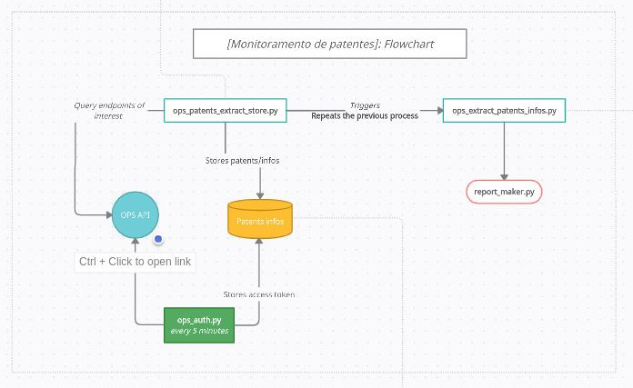
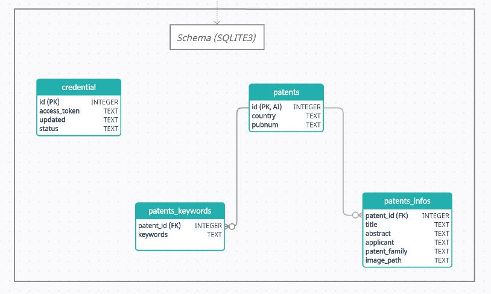
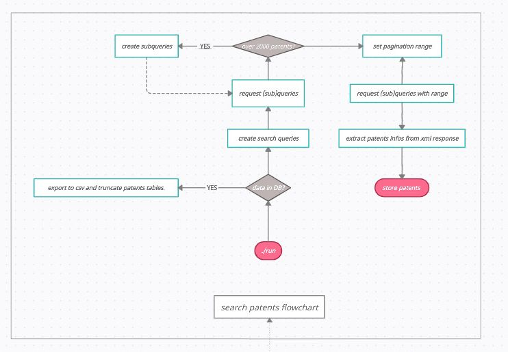
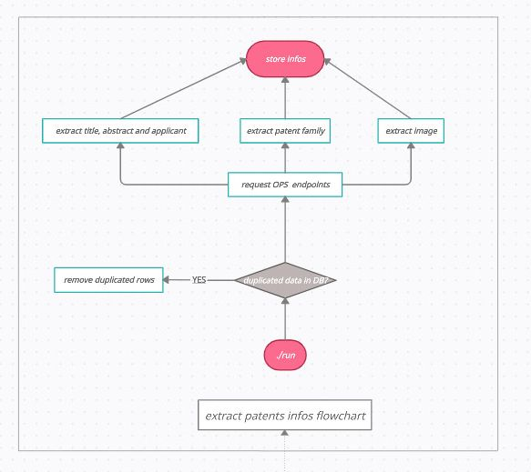

# monitoramento_patentes

Melhorias:
- [ ] Implementar uma heurística 	no método `create_query_over_2000` no módulo `utils.ops_search_query_maker.py`
<br>

# Usage and settings
1 - `git clone this_repo` ; `cd this_repo` ; `pip install flit`; `flit install`
<br>
<br>
2 - Schema já criado no `new_ops.db`
<br>
<br>
3 - Criar um `.env` no diretório `monitor_patents_ops`

```
# SQLITE3 OPS INFOS
OPS_DB_PATH='monitor_patents_ops/new_ops.db'

# OPS Auth
OPS_AUTH_CONSUMER_KEY=<yourkey>
OPS_AUTH_SECRET_KEY=<yourkey>
OPS_AUTH_ENDPOINT='https://ops.epo.org/3.2/auth/accesstoken'

# OPS CODES
IPC_CODES="['A61K8/00', 'A61K8/02', 'A61K8/03', 'A61K8/04', 'A61K8/06', 'A61K8/11', 'A61K8/14', 'A61K8/18', 'A61K8/19', 'A61K8/20', 'A61K8/21', 'A61K8/22', 'A61K8/23']"

# OPS Query
OPS_SEARCH_ENDPOINT='http://ops.epo.org/3.2/rest-services/published-data/search{}q='
OPS_PATENTFAMILY_ENDPOINT='http://ops.epo.org/3.2/rest-services/family/publication/docdb/{}'
OPS_CHECKIMAGES_ENDPOINT='http://ops.epo.org/3.2/rest-services/published-data/publication/docdb/{}/images'
OPS_RESTAPI_URL='http://ops.epo.org/3.2/rest-services/'

### Keywords to filter ###
KEYWORDS_FILTER="['data driven', 'intelligence artificial', 'machine learning', 'data science', 'analytics', 'big data', 'deep learning', 'digital transformation', 'business intelligence', 'blockchain', 'internet of things', 'data lake', 'business design', 'research and development', 'research and innovation']"

### Report Maker images paths and variables ###
DESCRIPTIONS="('Título', 'Número de públicação', 'Keywords', 'Abstract', 'Detentor da patente', 'Família de patentes')"


### SQLITE exports variables ###
CSV_HEADERS="[('País', 'Número de Públicação', 'Título', 'Keywords', 'Abstract', 'Detentor da patente', 'Família de patentes', 'Imagem')]"
EXP_PATH='../files/exports/monitoramento_patentes_'
```
<br>

# Fluxogramas


<br>

<br>

<br>

